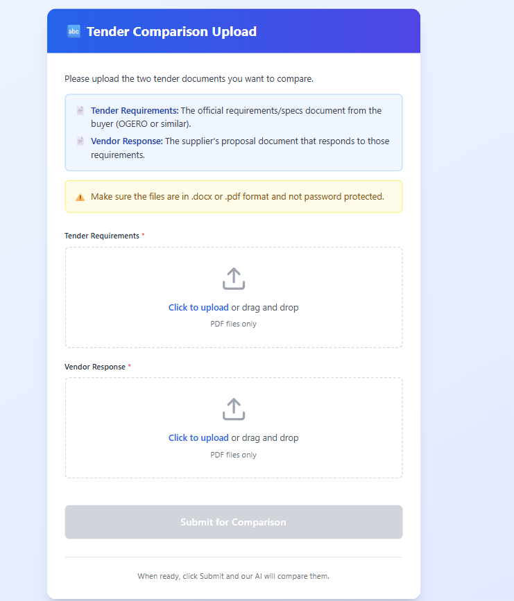
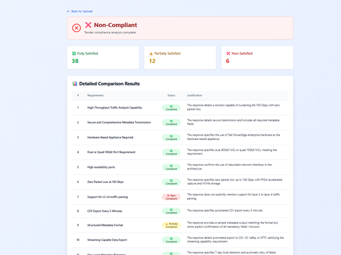
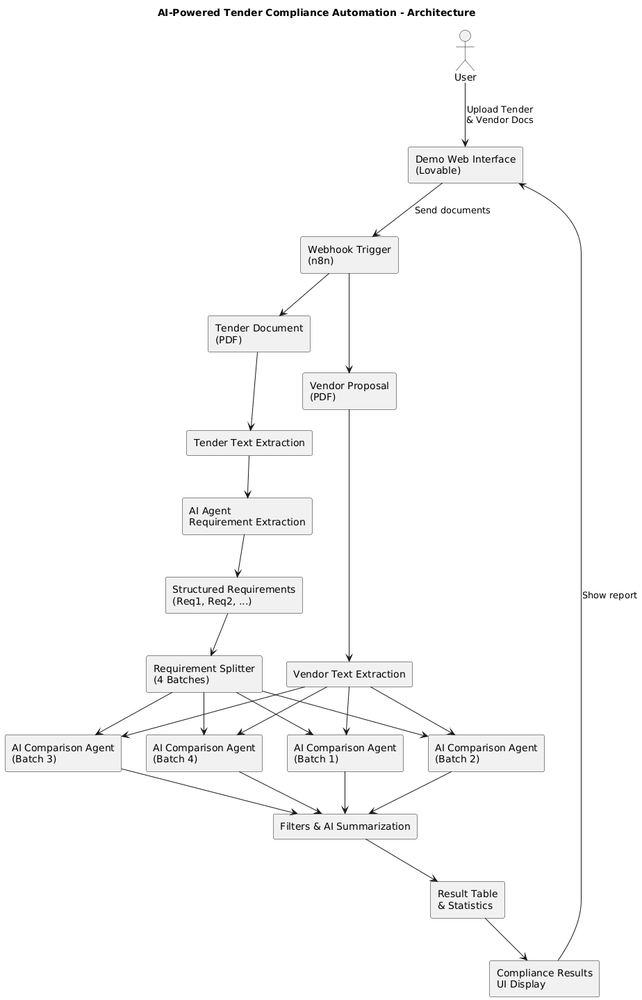

# AI-Powered Tender Compliance Automation (n8n)
**Developed by Ali Azzam**

---

## Overview
Evaluating tenders is a time-consuming and error-prone process. Organizations must manually compare detailed requirement documents against equally long vendor proposals to determine whether each requirement is satisfied, partially addressed, or ignored.

This project automates tender evaluation using AI-powered workflows. By comparing tender requirements against vendor responses, the system generates a structured compliance report in minutes instead of days.

---

## Demo screenshots

### Upload interface
Users upload the tender requirements document and the vendor proposal through a simple web interface.

### Compliance results
After analysis, the system displays a structured compliance report including summaries and detailed justifications.

---

## What the system does
- Accepts **two documents** via webhook:
  - Tender requirements
  - Vendor proposal
- Extracts and structures all tender requirements
- Compares each requirement against the full vendor response
- Classifies requirements as:
  - ✅ Fully Satisfied
  - ⚠️ Partially Satisfied
  - ❌ Not Satisfied
- Generates **clear AI-based justifications** for every classification
- Produces a final compliance summary and detailed report

---

## High-level architecture

> High-level view of the AI-powered tender compliance pipeline implemented in n8n.  
> The workflow orchestrates multiple AI agents in parallel with built-in rate-limit handling and result aggregation.  
>  
> Internal prompts, credentials, and detailed logic are intentionally not exposed.

---

## How it works

### 1. Document ingestion
- Tender and vendor documents are uploaded through a web interface.
- Files are sent to n8n via a webhook trigger.

### 2. Text extraction
- Tender document text is fully extracted and normalized.
- Vendor response text is extracted and preserved for semantic comparison.

### 3. Requirement structuring
- An AI agent parses the tender document.
- Requirements are extracted into individual, structured items (Req1, Req2, …).
- This guarantees that no requirement is overlooked.

### 4. Token-aware AI orchestration
Large tenders can exceed AI token and rate limits.  
To handle this reliably:

- Requirements are split into **four parallel batches**
- Each batch is processed by a dedicated AI agent
- Execution is throttled using timed delays
- This prevents token-per-minute and request-limit failures

### 5. Requirement evaluation
For each requirement:
- The AI compares it against the **entire vendor response**
- The requirement is classified as:
  - Fully Satisfied
  - Partially Satisfied
  - Not Satisfied
- A short justification is generated explaining the decision

### 6. Aggregation & reporting
- Results from all AI agents are merged
- A structured compliance report is generated including:
  - Summary counts
  - Detailed per-requirement explanations
- The final result is returned to the frontend via webhook response

---

## Demo interface
A lightweight demo interface (built with Lovable) is used to:
- Upload documents
- Display progress
- Visualize compliance results

> This interface is for demonstration purposes only.

---

## Tech stack
- **n8n** – Workflow orchestration
- **OpenAI** – Requirement extraction & semantic comparison
- **JavaScript** – Text processing & data formatting
- **Webhooks** – Document ingestion
- **Lovable** – Demo UI

---

## Use cases
- Tender & RFP compliance analysis
- Proposal gap identification
- Pre-submission validation
- Internal procurement review automation

---

## Results & impact
- ⏱ Reduced evaluation time from **days to minutes**
- 📊 Delivered clear, structured, and auditable results
- ⚖️ Improved objectivity through consistent AI evaluation
- 🔁 Reusable for tenders of any size or complexity
- 🧠 Designed with real-world AI constraints in mind (token limits, rate limits, large documents)

---

## 👨‍💻 Author

**Ali Azzam**  
Computer & Communication Engineering (CCE)  
Université Saint-Joseph (USJ), Lebanon

---

## 📜 License
This project is released under the **MIT License**.
