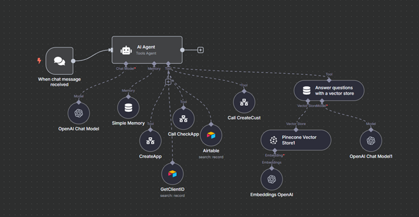
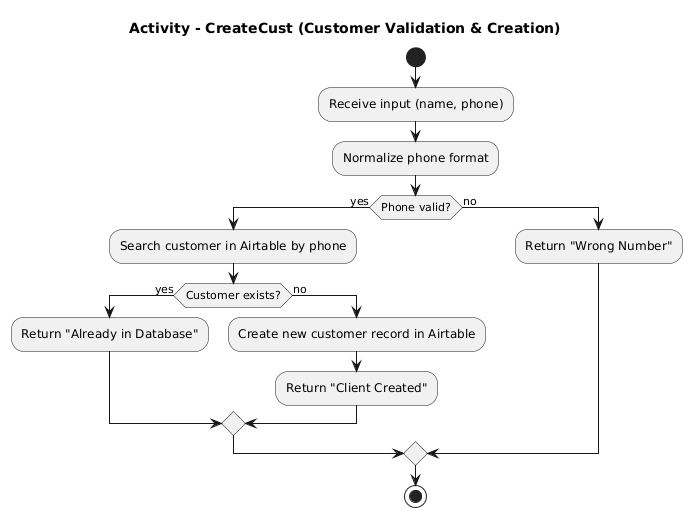
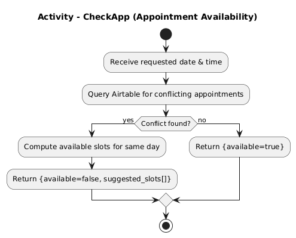
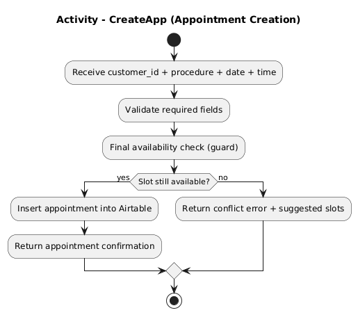
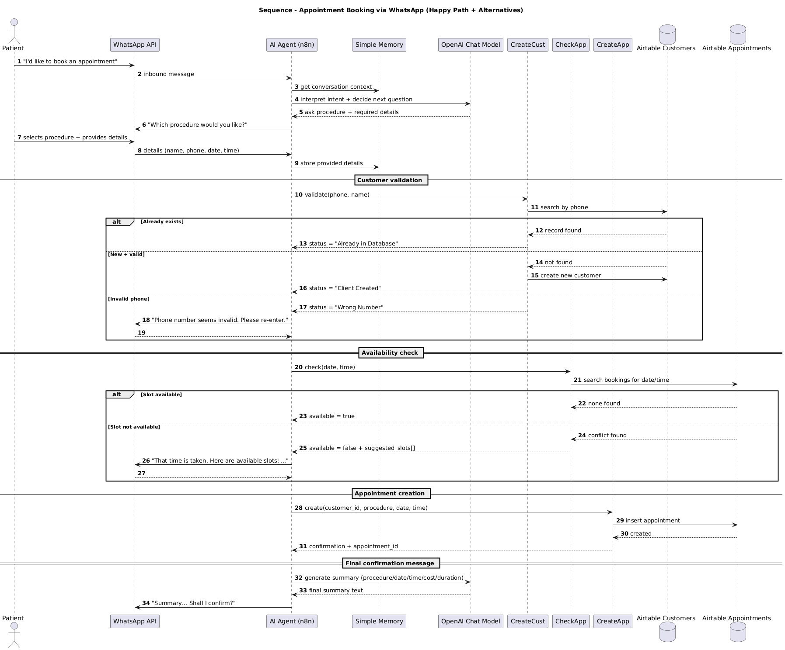

# 🦷 AI-Powered WhatsApp Dental Clinic Chatbot
**Developed by Ali Azzam**

---
This repository presents a **production-oriented AI automation system** designed to manage dental clinic appointments through **WhatsApp**, while also providing **reliable medical information** using a document-based knowledge base.

The project combines **conversational AI**, **workflow orchestration**, **database validation**, and **Retrieval-Augmented Generation (RAG)** to deliver a complete, scalable, and safe healthcare automation solution.

> ⚠️ **Important Note**  
> This public repository intentionally abstracts internal automation logic.  
> The focus is on **system architecture, design decisions, and behavior**, not on exposing proprietary workflows or business rules.

---

## 🎯 Problem Statement

Healthcare institutions such as dental clinics often rely on manual phone-based appointment scheduling.  
This approach:

- Consumes significant staff time  
- Is prone to scheduling errors  
- Does not scale with demand  
- Fails to meet patient expectations for instant digital services  

Additionally, patients frequently ask medical questions before booking, increasing the workload on clinic staff.

---

## 💡 Solution Overview

The proposed solution is an **AI-powered WhatsApp chatbot** capable of:

- Conversational appointment booking  
- Automated customer validation  
- Real-time appointment availability checks  
- Safe appointment creation  
- Medical question answering using an official clinic PDF  

All interactions are coordinated by a **central AI Agent** that orchestrates **specialized workflows (tools)** responsible for deterministic operations.

---

## 🧠 System Architecture (UML Component Diagram)

The system is designed using a **tool-oriented AI orchestration architecture**, where reasoning and execution are strictly separated.

### Architectural Principles

- **Single AI Agent for reasoning and decision-making**
- **Tool-based execution** for all side effects
- **Clear separation of concerns**
- **Database safety through validation gates**
- **Retrieval-Augmented Generation (RAG)** for medical knowledge

The AI Agent never directly accesses databases.  
All read/write operations are delegated to deterministic workflows.

---

## 🧩 Core Components

### AI Agent (Conversation Orchestrator)

The AI Agent is the entry point for all incoming WhatsApp messages.

Responsibilities:
- Detect user intent
- Maintain conversational context
- Decide which tool to invoke
- Synthesize structured results into natural language responses

Conversation state is stored using a lightweight memory mechanism.

---

### Tool-Based Workflow Orchestration

The agent dynamically invokes the following workflows:

#### **CreateCust — Customer Validation & Creation**
- Normalizes and validates phone numbers  
- Checks for existing customers  
- Prevents duplicate registrations  
- Returns explicit status:
  - `Already in Database`
  - `Client Created`
  - `Wrong Number`

---

#### **CheckApp — Appointment Availability**
- Verifies if a requested date and time are available  
- Detects conflicts in the appointments database  
- Automatically computes and suggests alternative slots when needed  

---

#### **CreateApp — Appointment Creation**
- Validates required fields  
- Performs a final availability check (guard condition)  
- Inserts the appointment into the database only if safe  

---

### Knowledge Retrieval (RAG)

To answer patient questions about dental procedures, the system uses a **Retrieval-Augmented Generation** approach.

- The clinic’s official PDF is embedded into a vector database  
- Patient questions are embedded and matched via similarity search  
- Relevant passages are retrieved and summarized into natural language  

The RAG pipeline is represented in the system architecture and detailed in the sequence diagram below.

---

## 🔄 Booking Flow (Sequence Diagram)

The following sequence diagram illustrates the **end-to-end appointment booking process**, including validation and alternative flows.

This flow demonstrates:
- Customer validation
- Availability checks
- Safe appointment creation
- Final confirmation messaging

---

## ❓ Patient Q&A Flow (RAG)

Patients may ask medical questions at any time during the conversation.

_Flow.png)

RAG ensures that:
- Answers are grounded in clinic-approved documents  
- Hallucinations are avoided  
- Medical information remains traceable and updatable  

---

## 🛠️ Technical Environment

| Layer | Technology |
|------|------------|
| Automation Engine | n8n |
| Messaging Platform | WhatsApp Business API |
| AI Model | OpenAI Chat Model |
| Memory | n8n Simple Memory |
| Database | Airtable (Customers & Appointments) |
| Vector Store | Pinecone |
| Embeddings | OpenAI Embeddings |
| Knowledge Source | Dental Procedures PDF |
| Hosting | Secure internal infrastructure |

---

## 🧪 Example User Journey

1. Patient writes: *“I’d like to book an appointment.”*  
2. Chatbot asks for the desired procedure  
3. Patient selects: **👑 Dental Crown**  
4. Chatbot requests name, phone number, date, and time  
5. Customer validation is executed (CreateCust)  
6. Appointment availability is checked (CheckApp)  
7. Appointment is created if available (CreateApp)  
8. Final confirmation summary is displayed  

Procedure: 👑 Dental Crown
Date: 2025-09-02
Time: 19:00
Duration: 60 minutes
Cost: €1200

At any time, the patient may ask medical questions, answered via the RAG pipeline.

---

## 📈 Results & Impact

- **24/7 appointment booking**
- **Reduced staff workload**
- **No duplicate or conflicting bookings**
- **Structured and reliable patient data**
- **Improved patient experience**

This project demonstrates how **AI-assisted automation** can be safely applied in healthcare contexts.

---

## 🧠 Design Decisions & Trade-Offs

- **Why tool-based orchestration?**  
  Separates reasoning from execution, improving safety and maintainability.

- **Why not expose internal workflows?**  
  Public repositories should demonstrate architectural competence without leaking business logic.

- **Why RAG instead of fine-tuning?**  
  Medical knowledge must be updatable, auditable, and source-grounded.

---

## 🔒 Security & Data Handling

- No credentials or secrets are included  
- All identifiers are anonymized or mocked  
- Production configuration is managed outside this repository  

---

## 🚀 Project Status

**Completed — Production-ready architecture**

This repository is intended as:
- A final-year engineering project reference  
- A professional automation portfolio piece  
- A client-safe system design demonstration  

---

## 👨‍💻 Author

**Ali Azzam**  
Computer & Communication Engineering (CCE)  
Université Saint-Joseph (USJ), Lebanon

---

## 📜 License
This project is released under the **MIT License**.
