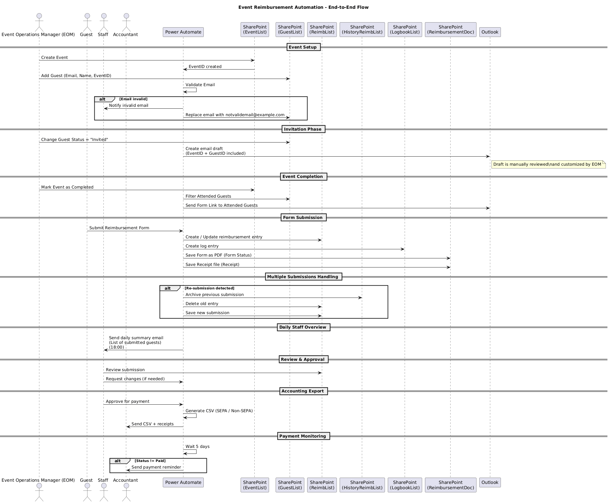
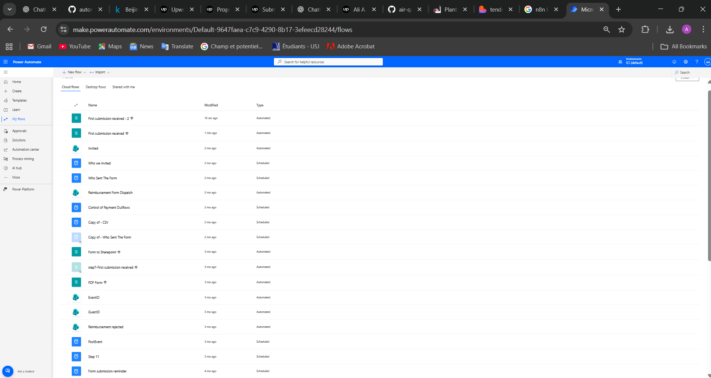
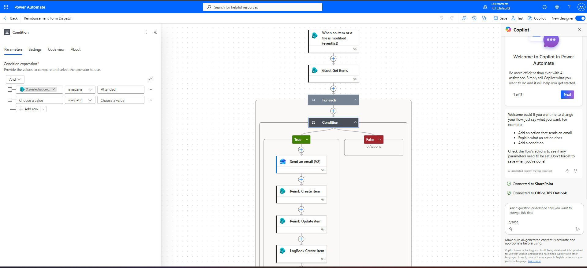
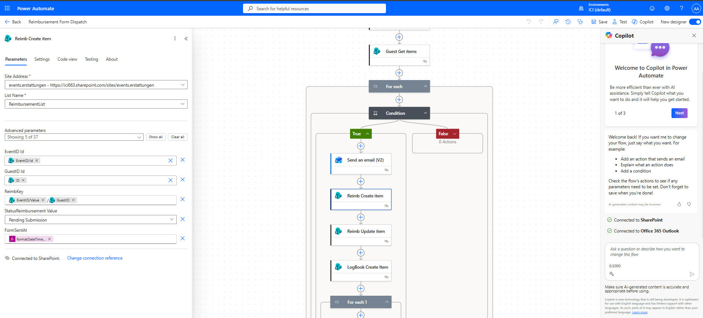
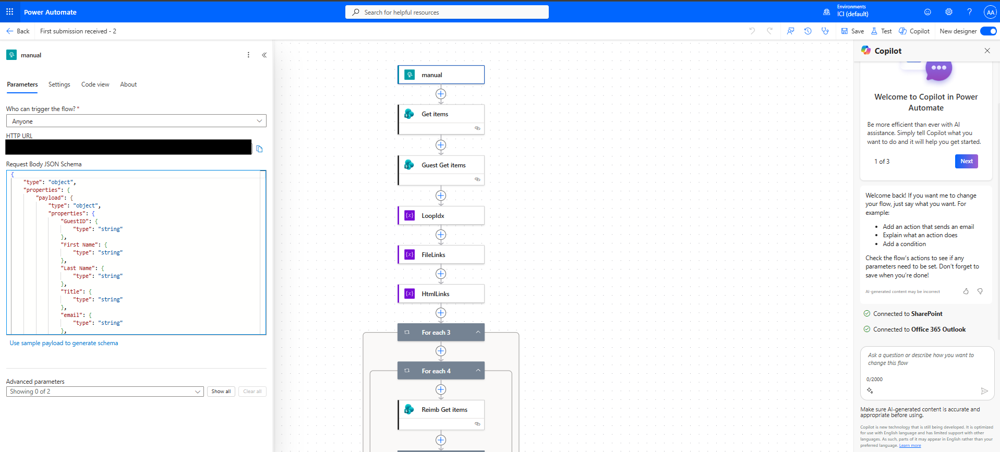
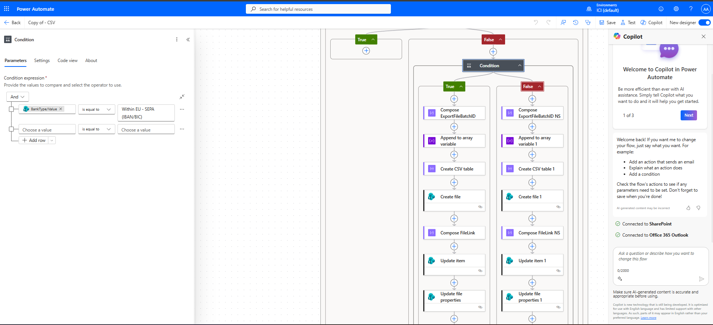
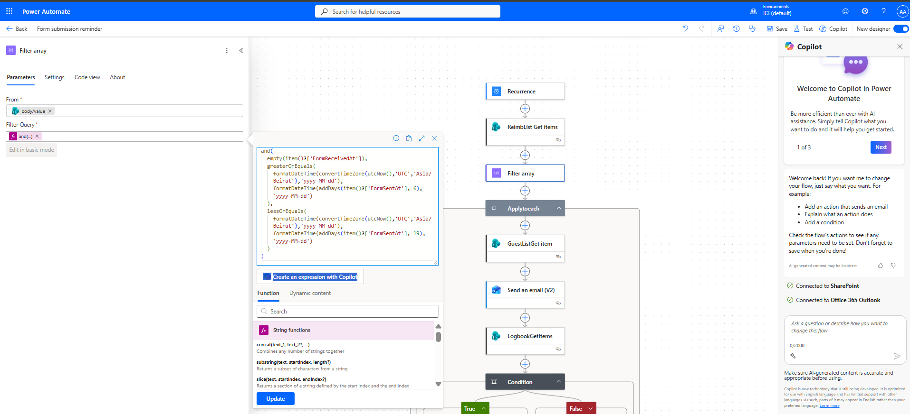

# Event Reimbursement Automation  
**End-to-End Power Automate & SharePoint System**

**Developed by Ali Azzam**

---

This repository presents a **production-ready event reimbursement automation system** built using **Microsoft Power Automate, SharePoint Online, and Outlook**.

The solution manages the **entire reimbursement lifecycle** — from event creation and guest invitation to accounting export and payment follow-up — with a strong focus on **auditability, idempotency, human control, and financial safety**.

It reflects real-world enterprise constraints rather than demo-style automation.

---

## 🧠 System Overview

The system coordinates multiple business roles:

- **Event Operations Manager (EOM)**  
  Owns the event lifecycle and controls invitations.

- **Guests**  
  Submit reimbursement forms after attending an event.

- **Staff**  
  Review submissions, request corrections, and approve payments.

- **Accountant**  
  Processes payments based on validated CSV exports.

**Power Automate** acts as the orchestration layer, while **SharePoint** serves as the system of record.

---

## 🏗 System Architecture

The following diagram illustrates the **end-to-end architecture** of the system, showing:

- Human-in-the-loop decision points  
- Power Automate as the orchestration engine  
- SharePoint lists and document libraries as persistent storage  
- Outlook as the communication layer  
- Clear separation between operational, review, and accounting phases  

---

## 🗂 Data Model & Storage

The solution relies on the following SharePoint components:

- **EventList**  
  Stores events and lifecycle status.

- **GuestList**  
  Stores guests linked to events.

- **ReimbList**  
  Active reimbursement submissions.

- **HistoryReimbList**  
  Archived submissions (used when re-submissions occur).

- **LogbookList**  
  Audit trail for traceability and compliance.

- **ReimbursementDoc**  
  Document library for generated PDFs and uploaded receipts.

---

## 🔁 End-to-End Workflow

### 1️⃣ Flow Inventory

The system is implemented using multiple **specialized Power Automate flows** (automated, scheduled, and manual).  
Each flow has a single responsibility, improving reliability and maintainability.

---

### 2️⃣ Guest Eligibility & Form Dispatch

Once an event is marked as completed:

- Guests are filtered by **attendance**
- Only eligible guests receive the reimbursement form
- Invalid emails are detected and handled safely

This prevents unauthorized or premature submissions.

---

### 3️⃣ Reimbursement Record Creation

For each eligible guest:

- A reimbursement entry is created in `ReimbList`
- **Idempotency is enforced** using a composite key  
  `(EventID + GuestID)`
- Initial status is set to `Pending Submission`
- Timestamps are recorded for traceability

---

### 4️⃣ Secure Form Submission Entry Point

Reimbursement forms are accessed through a **controlled webhook / manual trigger**:

- Only invited guests can submit
- Submission itself represents a valid state transition
- No fragile internal conditions are required

This ensures a clean and secure boundary for state changes.

---

### 5️⃣ Accounting Export (SEPA / Non-SEPA)

Approved reimbursements are:

- Filtered by validation and approval status
- Split into **SEPA** and **Non-SEPA** banking flows
- Exported as CSV files
- Marked as `Exported` to prevent duplicate payments
- Sent to the accountant with all supporting documents

---

### 6️⃣ Reminder & Payment Monitoring

A scheduled control flow ensures financial follow-up:

- Time-window-based reminders (6–19 days)
- Timezone-aware logic (`Asia/Beirut`)
- Automatic reminders if payment remains unpaid after 5 days

This prevents missed or forgotten payments.

---

## 🧩 Key Design Principles

- **Human-in-the-loop**  
  Invitation emails are drafted, not automatically sent.

- **Idempotency**  
  Guaranteed via `(EventID + GuestID)` to avoid duplicates.

- **Auditability**  
  Every action is logged and archived.

- **Financial safety**  
  Export flags and reminders prevent double payments.

- **Scalability & clarity**  
  Modular flows with clear responsibilities.

---

## 🧪 Technologies Used

- Microsoft Power Automate  
- SharePoint Online (Lists & Document Libraries)  
- Microsoft Outlook  
- CSV / SEPA-compatible accounting exports  

---

## 👨‍💻 Author

**Ali Azzam**  
Computer & Communication Engineering (CCE)  
Université Saint-Joseph (USJ), Lebanon  

---

## 📜 License

MIT License
